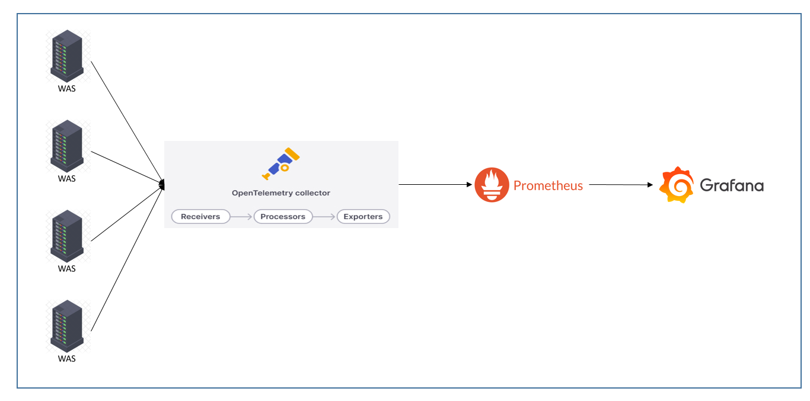

# OpenTelemetry 활용

## 목차
- [OpenTelemetry 활용](#opentelemetry-활용)
  * [일정](#일정)
  * [repository 디렉토리 설명](#repository-디렉토리-설명)
  * [OpenTelemetry](#opentelemetry)
  * [장단점](#장단점)
    + [장점](#장점)
    + [단점](#단점)
  * [OpenTelemetry 와 prometheus 의 관계 그림 설명](#opentelemetry-와-prometheus-의-관계-그림-설명)
  * [OpenTelemetry collector 도식도](#opentelemetry-collector-도식도)
  * [OpenTelemetry 최종 활용 단계 예상도](#opentelemetry-최종-활용-단계-예상도)

## 일정

| 기간               | 항목                     | 세부내용                                                                                                                                                                                                                  |
|------------------|------------------------|-----------------------------------------------------------------------------------------------------------------------------------------------------------------------------------------------------------------------|
| 5월 08일 ~ 5월 10일  |사전 조사    | - OpenTelemetry 란  - OpenTelemetry 활용 방안                                                                                                                                                                          |
| 5월 10일 ~ 5월 20일  |데모 환경 구축 | - 데모 어플리케이션 테스트 - JAVA(SpringBoot - agent) - JAVA(SpringBoot - SDK) - Python(django - SDK)  - OpenTelemetry 환경 구성 - OpenTelemetry agent - OpenTelemetry collector - prometheus 환경 구성 - 로컬 환경 구성 |
| 5월 20일 ~ 6월 21일  |테스트 어플리케이션 정리 및 데이터 추가 |- 테스트 어플리케이션 정리 및 데이터 추가 - SDK - Java application - SDK - Python application - Agent - Java application - 데이터 호출 어플리케이션 개발 - Opentelemetry 데모 실행 - 단위테스트 진행|
| 6월 21일 ~ 6월 28일  |시각화 툴 연동 |- Prometheus - Metrics - Jaeger - Tracing, Logging - Graphana - 시각화|
| 6월 28일 ~ 7월 12일  |테스트 진행 |- Opentelemetry + Test application 통합테스트 진행|
| 7월 12일 ~ 7월 19일  |산출물 작성 |- 사용방법 및 가이드라인 문서 작성 - 수요지식회 발표자료 작성|
#### 5월 8일 ~ 5월 10일
- 사전 조사
  - OpenTelemetry 란
  - OpenTelemetry 활용 방안

#### 5월 10일 ~ 5월 20일
- 데모 환경 구축
  - 데모 어플리케이션 테스트
    - JAVA(SpringBoot - agent)
    - JAVA(SpringBoot - SDK)
    - Python(django - SDK)
  - OpenTelemetry 환경 구성
    - OpenTelemetry agent
    - OpenTelemetry collector
  - prometheus 환경 구성
    - 로컬 환경 구성

#### 5월 20일 ~ 6월 21일
- 테스트 어플리케이션 정리 및 데이터 추가
  - SDK - Java application
  - SDK - Python application
  - Agent - Java application
  - 데이터 호출 어플리케이션 개발
  - Opentelemetry 데모 실행
  - 단위테스트 진행

#### 6월 21일 ~  6월 28일
- 시각화 툴 연동
  - Prometheus - Metrics
  - Jaeger - Tracing, Logging
  - Graphana - 시각화

#### 6월 28일 ~ 7월 12일
- 테스트 진행
  - Opentelemetry + Test application 통합테스트 진행

#### 7월 12일 ~ 7월 19일
- 산출물 작성
  - 사용방법 및 가이드라인 문서 작성
  - 수요지식회 발표자료 작성

---
## repository 디렉토리 설명
- [otel-collector](otel-collector)
  - OpenTelemetry 의 collector 실행 파일 및 설정파일

- [otel-java-agent](otel-java-agent)
  - SDK 방식의 SpringBoot 실행 파일 (otel-sdk-test-springboot.jar)
  - Agent 방식의 SpringBoot 실행 파일 (otel-test-springboot.jar)
  - OpenTelemetry 의 agent 파일 (opentelemetry-javaagent.jar)

- [application](application)
  - 테스트 환경에서 실행할 어플리케이션을 모아놓은 디렉토리 

- [application/otel-sdk-django-01](application/otel-sdk-django-01)
  - SDK 방식으로 사용할 Django 프로젝트

- [application/otel-sdk-springboot-01](application/otel-sdk-springboot-01)
  - SDK 방식으로 사용할 SpringBoot 프로젝트 파일

- [application/nginx](application/nginx)
  - 테스트 어플리케이션에서 사용할 Nginx

- [application/otel-collector](application/otel-collector)
  - 테스트 어플리케이션에서 사용할 collecot 

---

## OpenTelemetry
- OpenTelemetry(OTel)는 개발 팀이 단일 통합 형식으로 원격 측정 데이터를 생성, 처리 및 전송할 수 있는 오픈 소스 Observability 프레임워크
- OpenTelemetry는 추적 , 메트릭 및 로그 와 같은 원격 측정 데이터를 생성하고 관리하도록 설계된 관찰 프레임워크 및 도구 키트
- OpenTelemetry는 공급업체 및 도구에 구애받지 않습니다. 즉, Jaeger 및 Prometheus 와 같은 오픈 소스 도구 는 물론 상용 제품을 포함한 다양한 Observability 백엔드와 함께 사용할 수 있습니다

출처  
  - https://opentelemetry.io/docs/what-is-opentelemetry/ 번역
  - https://www.elastic.co/kr/what-is/opentelemetry

---
## 장단점
### 장점
- 표준화된 추적 및 모니터링: 
  - OpenTelemetry는 분산 시스템에서 발생하는 추적 및 모니터링을 표준화하고 통합함으로써 개발자들이 다양한 환경에서 일관된 방식으로 데이터를 수집하고 분석할 수 있습니다.
- 클라우드 네이티브 환경과 통합: 
  - 클라우드 네이티브 환경에서 자주 사용되는 서비스들과의 통합을 지원하여, 애플리케이션의 클라우드 호스팅 및 관리를 단순화합니다.
- 다양한 언어 및 프레임워크 지원: 
  - OpenTelemetry는 다양한 프로그래밍 언어 및 프레임워크를 지원하여, 개발자들이 자신의 환경에 적합한 라이브러리를 선택할 수 있도록 합니다.
- 유연한 구성 및 확장성: 
  - OpenTelemetry는 다양한 설정 및 확장 기능을 제공하여, 사용자가 필요에 맞게 구성하고 확장할 수 있습니다.
- 벤더에 종속되지 않음

### 단점
- 학습 곡선: 
  - OpenTelemetry는 강력하고 유연한 도구이지만, 초기 설정 및 사용에 있어서 학습 곡선이 존재할 수 있습니다. 특히 분산 시스템의 복잡성에 대한 이해가 필요합니다.
- 성능 오버헤드: 
  - OpenTelemetry를 사용하면 애플리케이션의 성능에 약간의 오버헤드가 발생할 수 있습니다. 이는 추가적인 추적 및 모니터링 작업이 수행되기 때문입니다. 하지만, 이러한 오버헤드는 대부분의 경우 실제 운영에 미치는 영향을 최소화할 수 있습니다.

출처 : 
  - Chat GPT
  - https://www.elastic.co/kr/what-is/opentelemetry#benefits-of-opentelemetry

---
## OpenTelemetry 와 prometheus 의 관계 그림 설명
__현재 여기까지 진행 완료__

출처 : https://www.asserts.ai/blog/opentelemetry-histograms-with-prometheus/

## OpenTelemetry collector 도식도

출처 : https://opentelemetry.io/docs/collector/

## OpenTelemetry 최종 활용 단계 예상도

출처 : https://grafana.com/blog/2023/07/20/a-practical-guide-to-data-collection-with-opentelemetry-and-prometheus/

