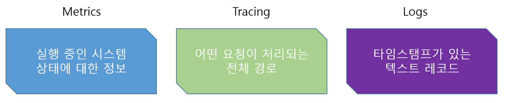

# OpenTelemetry

- [OpenTelemetry](#opentelemetry)
  + [모니터링](#모니터링)
  + [옵저버빌리티](#옵저버빌리티)
  + [옵저버빌리티의 필요성](#옵저버빌리티의-필요성)
  + [옵저버빌리티와 MTTR](#옵저버빌리티와-mttr)
  + [옵저버빌리티의 구성요소](#옵저버빌리티의-구성요소)
    - [Log에 포함되는 정보](#log에-포함되는-정보)
    - [Metric에 포함되는 정보](#metric에-포함되는-정보)
    - [Trace에 포함되는 정보](#trace에-포함되는-정보)
    - [span에 포함되는 정보](#span에-포함되는-정보)
  + [옵저버빌리티에서 가장 중요한 내용은?](#옵저버빌리티에서-가장-중요한-내용은)
  + [오픈텔레메트리 이전의 방식](#오픈텔레메트리-이전의-방식)
    - [오픈트레이싱과 오픈센서스란?](#오픈트레이싱과-오픈센서스란)
  + [오픈텔레메트리란?](#오픈텔레메트리란)
    - [오픈텔레메트리의 강점](#오픈텔레메트리의-강점)
  + [OpenTelemetry 구성 요소](#opentelemetry-구성-요소)
    - [OpenTelemetry Collector](#opentelemetry-collector)
    - [OpenTelemetry Collector 구성 방법](#opentelemetry-collector-구성-방법)
      * [Agent Collector 방식](#agent-collector-방식)
    - [Gateway Collector 방식](#gateway-collector-방식)
  + [오픈텔레메트리 데이터 계측 방법](#오픈텔레메트리-데이터-계측-방법)
    - [지원해 주는 언어 / 플랫폼](#지원해-주는-언어--플랫폼)
      * [API , SDK](#api--sdk)
      * [zero-code](#zero-code)
    - [Auto 방식](#auto-방식)
    - [Auto - Agent 방식](#auto--agent-방식)
    - [Manual(SDK) 방식](#manualsdk-방식)
    - [사용 방식 선택](#사용-방식-선택)
  * [2024.07.06 254 라인까지 작성](#20240706-254-라인까지-작성)
    + [데모 시연](#데모-시연)
      - [참고링크](#참고링크)
      - [개발 참고 링크](#개발-참고-링크)
      - [참고 영상](#참고-영상)


### 모니터링
- 시스템 또는 서비스의 현재 성능, 상태, 작동 여부를 실시간으로 확인하는 활동을 말함
- IT 운영에는 필수적으로 들어가며, 문제 발생 시 조기에 발견하고 대응하기 위해 사용
---

### 옵저버빌리티
- 옵저버빌리티는 우리나라 말로 바꾸면 관측성 또는 관찰 가능성 이라고 말함
- 그럼 모니터링과의 차이점은?
  - 모니터링은 시스템에서 출력되는 데이터를 수집하고 상태를 확인하는 활동이고,
  - 옵저버빌리티는 거기서 한단계 더 나아가 시스템에서 출력되는 데이터를 가지고 근본적인 원인을 찾아가는 디버깅이 섞여 있는 활동

- 모니터링은 무엇(사용률/장애)에 중점을 두었다면 옵저버빌리티는 왜(어디서/무엇 때문에)에 중점을 두고 있음
---

### 옵저버빌리티의 필요성
- 모니터링에선 할수 없는 근본적인 원인을 찾는 것
  - 장애가 어디서 발생하였지?
  - 시스템이 왜 느려졌지?

- 장애 발생 시 아래의 항목에 대해서 대비가 안되어 있으면 옵저버빌리티가 필요함
  - 현재 서비스가 정상인지 비정상인지 판단할 수 있는 기준이 있음
  - 비정상 상황 발생시 목표 시간내에 인지할 수 있음
  - 목표 시간 내에 비정상의 원인(Root Cause) 를 찾아낼 수 있음
  - 목표 시간 내에 해당 원인을 수정해서 서비스를 정상화 시킬 수 있음
---

### 옵저버빌리티와 MTTR


- MTTD(Mean Time To Detect) : 장애발생 -> 장애인지 (장애를 인지하는데 걸리는 시간)
- MTTI(Mean Time to Identify) : 장애인지 -> 원인파악 (장애인지 후 원인파악에 걸리는 시간)
- MTTR(Mean Time To Repair) : 장애발생 -> 장애인지 -> 원인파악-> 복구완료 (장애발생 후 복구까지 걸리는 시간)

- 모니터링만 도입하였을 장애 인지는 되지만 원인 파악(MTTI)에서 어려움이 발생할 가능성이 높음
- 옵저버빌리티 도입하면 Tracing을 통해 빠르게 원인파악이 가능함

### 옵저버빌리티의 구성요소



- 옵저버빌리티는 세가지 구성요소로 이뤄져있으며 해당 구성요소들을 원격 측정 데이터(telemetry data)라고 함
  - Log : 로그는 시간기반 텍스트
  - Metric : 런타임 환경(시스템)에서 측정된 값
  - Trace : 어떤 요청이 처리될 때 경로(큰그림)이며 여러개의 Span 으로 이뤄짐
    - Span : Trace의 기본 구성요소로, 개별 작업 또는 요청의 구간을 말함
    - Span은 트리구조로 이뤄져있으며, Root span, Child span 으로 구분함


#### Log에 포함되는 정보
- 로그는 시스템에서 발생한 이벤트에 대한 기록임
  - ex) 우리가 흔히 알고 있는 LOGGER 라고 생각하면 됨
    - Timestamp : 로그가 기록된 시간
    - Log level : 로그레벨
    - Message : 로그 내용으로 개발자가 작성한 로그나 오류 발생에 대한 내용
    - Context information : 추가적인 정보로 이벤트와 관련된 정보


#### Metric에 포함되는 정보
- 메트릭은 시스템의 지표를 측정하는데 사용함
- 대표적으로 호스트 관련 성능 지표
  - ex) CPU / Memory 사용량 또는 API 호출 횟수
    - Name : 메트릭의 고유 이름
    - Value : 메트릭의 수치 값이며, 특정 시간에 측정된 값
    - Timestamp : 메트릭이 측정된 시간
    - Labels : 메트릭에 대한 추가정보

[//]: # ()


#### Trace에 포함되는 정보
- Trace는 요청의 저리과정을 추적하는데 사용함
- 시간이 얼마나 소요되는지, 어떤 경로를 가지고 있는지 확인
  - ex) 사용자 조회 API 호출 시 백엔드에서 내부적으로 호출되는 메서드들을 추적
    - Trace id : 트레이스를 식별하는데 사용되는 고유ID이며, 트레이스 내에서 존재하는 Span은 같은 트레이스 ID를 사용함
    - Spans : 트레이스는 하나 혹은 여러개의 스팬으로 구성됨

- Context Propagation(컨텍스트 전파)
  - 다른 시스템을 호출할 경우 추적할 수 있도록 trace ID를 전달


#### span에 포함되는 정보
- Span은 Trace를 구성하는 기본단위로 전체 처리 구간에서 세부 구간을 의미함
- 트리구조로 이뤄져있으며, 상위span의 정보를 포함하고 있음
  - ex) 사용자 조회에서 컨트롤러 ,서비스, 맵퍼에서 각각의 구간 말함
  - Trace id : 속해 있는 트레이스의 id
  - span id : Span의 고유 id
  - parent span id : 부모 Span id
  - Operation Name : span의 이름
  - start time : span의 시작 시간
  - end time : span의 종료 시간
  - Tags : span과 관련된 메타 데이터
  - Event : span에 기록할 내용


---

### 옵저버빌리티에서 가장 중요한 내용은?
- 옵저버리리티에서 가장 중요한 것은 Trace임
- 성능 관련 문제가 발생했을 때 트레이스 없이는 분석하기가 힘듬
```text
ex) 어떤 요청이 10초 걸린다고 예를 잡았을때
해당 요청에는 무수히 많은 시스템을 거처감
이럴때 로그에 어떤 요청인지, 누가요청했는지, 시간이 얼마나 걸리는지 남기면 찾을수 있음
하지만 이 방법은 하나의 시스템 내에서는 파악이 가능하지만
MSA 환경에서는 여러개의 컴포넌트들을 다 분석해야 할때는 현실적으로 어려움
```
- Trace는 자세한 경로를 기록하므로 개발자 혹은 운영자에게 시스템이 어떻게 돌아가는지 이해할 수 있는 큰 그림을 제시해줌
---

### 오픈텔레메트리 이전의 방식
- 각각의 에이전트 또는 백엔드를 구성하여 텔레메트리 데이터를 수집함
- 텔레메트리 수집 방식을 변경하려면 라이브러리 ,에이전트, 백엔드를 변경해야 하며 많게는 소스까지 수정해야 하는 상황이 생김


#### 오픈트레이싱과 오픈센서스란?
- 오픈텔레메트리 이전에 오픈트레이싱(OpenTracing)과 오픈센서스(OpenCensus)가 있었음
- 오픈트레이싱은 CNCF 산하의 프로젝트로 하나의 흐름을 공개적으로 추적하기 위한 기능을 표준화하는 프로젝트
  - 오픈트레이싱은 트레이싱 부분을 커버하는 표준
  - 대표적인 구현체로 jaeger와 zipkin이 있음
- 오픈센서스는 트레이싱과 메트릭을 커버하는 표준
  - 오픈센서스는 엡에서 metric과 trace를 수집, 실시간 전송, 백엔드로 보내기 전 데이터를 변환할 수 있는 프록시를 정의
- 오픈트레이싱과 오픈센서스의 장점을 결합한 다음 버전이 바로 오픈텔레메트리
  - 오픈텔레메트리는 오픈트레이싱과 동일한 속성을 사용하지만 SDK와 OpenTelemetryCollector를 함께 제공
  - 오픈텔레메트리는 오픈센서스를 통합하고 다른 구성 요소와 호환될 수 있도록 API를 제공하여 확장성과 접근성을 높임
  - 오픈텔레메트리 = 오픈트레이싱 + 오픈컨센서스 + 로그에 대한 표준

---

### 오픈텔레메트리란?
- 오픈텔레메트리는 간단하게 오텔이라 불림
- 옵저버빌리티를 도와주는 일종의 프레임워크임
- 옵저버빌리티의 사실상 표준으로 자리잡고 있음
- 그라파나,예거,프로메테우스, 데이타독 그리고 국내의 와탭에서 오픈텔레메트리를 지원해주고있음
- 오픈텔레메트리는 원격 측정 데이터에 대해서 수집, 데이터 처리, 내보내기를 지원해주며 다양한 API와 SDK를 제공해줌
- 호환성 높은 모니터링 플랫폼 개발이 가능함

#### 오픈텔레메트리의 강점
- 표준화된 규격을 사용함(W3C)
  https://opentelemetry.io/docs/specs/otel/trace/api/#spancontext
  https://www.w3.org/TR/trace-context/
- 통합 수집(log,metric,trace)
- 다양한 오픈소스 지원(prometheus , jaeger ,grafana 등)
- 다양한 언어 지원(Java, Python)
- 벤더에 종속되지 않음


---

### OpenTelemetry 구성 요소
- Auto / Manual Instrumentation (계측)
- OpenTelemetry Collector (수집, 처리, 내보내기)


#### OpenTelemetry Collector
- 오픈텔레메트리 콜렉터는 다양한 소스에서 수집된 원격 측정 데이터를 중앙에서 수집, 처리, 변환, 내보내는 기능을 제공
  - 수집기(Receiver): 외부 소스로부터 데이터를 수집
  - 프로세서(Processor): 수집된 데이터를 필터링, 집계, 변환 (형식 변환, 내용 추가/제거)
  - 내보내기(Exporter): 처리된 데이터를 다양한 백엔드로 전송 (prometheus , Jaeger, Loki 등)
  - 확장 모듈(Extension): 콜렉터에 추가 기능을 제공하는 모듈


#### OpenTelemetry Collector 구성 방법
- 콜렉터를 어떻게 구성하는가에 따라서 Agent/Gateway 모드가 가능함

##### Agent Collector 방식


- 애플리케이션과 같은 호스트 또는 레벨에서 실행
- 장점:
  - 에이전트가 애플리케이션과 같은 환경에 있기 때문에 네트워크 지연이 적음
  - 설정 및 관리가 비교적 간단
- 단점:
  - 각 서버나 컨테이너에 에이전트를 설치해야 하므로, 관리 분산
  - 리소스 사용량이 증가할수 있음
  - Agent 콜렉터의 정보가 변경될 경우 모든 애플리케이션에서 콜렉터 정보를 변경해야 함

#### Gateway Collector 방식


- 데이터 센터 또는 파드에서 독립적으로 실행되며 같은 환경 내에 Agent로부터 데이터 수신
- 게이트웨이는 서비스 형태로 배포되는것을 말함
- 장점:
  - 중앙 집중식 관리가 가능하여 모니터링 및 유지보수 용이
  - 각 애플리케이션 서버에 에이전트를 설치하지 않아도 됨
  - 확장성이 좋고, 여러 애플리케이션에서 수집된 데이터를 통합하여 분석 가능
- 단점:
  - 네트워크 트래픽 증가
  - 추가적인 게이트웨이 인프라 필요
  - 애플리케이션과 게이트웨이 간의 통신에 따른 네트워크 지연 발생 가능성


---
### 오픈텔레메트리 데이터 계측 방법
- 오픈텔레메트리를 애플리케이션에 적용하여 계측하는 방법은 크게 두가지가 있음
- Auto / Manual Instrumentation
- 각각의 방식 마다 차이점이 존재함
  - 오픈텔레메트리의 SDK를 사용한다고 해서 꼭 콜렉터로 보내지 않아도되며, 모니터링 툴로 데이터를 보낼 수 있음
  - 아래 그림과 같이 Collector 없이 사용 가능함


    - ex) 애플리케이션 -> Jaeger
    - ex) 애플리케이션 -> prometheus

---
#### 지원해 주는 언어 / 플랫폼
##### API , SDK
C++
.NET
Erlang/Elixir
Go
Java
JavaScript
PHP
Python
Ruby
Rust
Swift
##### zero-code
Go
.NET
PHP
Python
Java
JavaScript

#### Auto 방식
- 프레임워크나 라이브러리 수준에서 자동으로 설정
  - 애플리케이션 설정을 통해 자동으로 계측 (yml 또는 setting.py 파일등)
- 장점
  - 편리한 설정
  - 코드 수정 없음
- 단점
  - 프레임워크 종속성, 세부 조정의 제한, 애플리케이션 파일 수정
  - 설정 없이 사용이 가능하나 필요하지 않은 데이터까지 넘어옴

#### Auto - Agent 방식
- 애플리케이션 코드 변경 없이 에이전트를 통해 데이터 수집
  - 애플리케이션 실행 시 환경변수 또는 명령줄 옵션을 통해 설정 ex) set log_exporter otlp
- 장점
  - 빠르고 간편한 적용
  - 코드 수정 없음
  - 애필르케이션에 미치는 영향을 최소화함
- 단점
  - 세밀한 제어가 어려움, 설정에 대한 이해 필요,
  - 설정 없이 사용이 가능하나 필요하지 않은 데이터까지 넘어옴

#### Manual(SDK) 방식
- 애플리케이션에 코드를 직접 추가하여 트레이스, 메트릭, 로그 데이터를 생성 및 전송
- 장점
  - 세밀한 제어 가능, 커스텀 메트릭 생성 용이
- 단점
  - 코드 변경 필요, 학습 곡선 존재

#### 사용 방식 선택
- Auto : 빠르고 편리한 설정이 필요한 경우
- Auto - Agent : 애플리케이션 코드를 변경하지 않고 빠르게 적용해야 하는 경우
- Manual(SDK) : 세밀한 제어와 커스텀 메트릭이 필요한 경우
---

2024.07.06 254 라인까지 작성
---------------------------

Agent 방식 , SDK 방식 , AutoConfigration 방식 설명
-- SDK와 Agent, zero code방식 소개
SDK : JAVA , Python
Agent or auto : JAVA , Python
zeor code : JAVA

-- java auto 방식에서 withSpan 사용내용 추가


-- SDK , Agent , Auto 장/단점 ※강조
오토, 에이전트 방식으로 하였을 때 장/단점
SDK 방식으로 하였을 때 장/단점

-- 테스트 애플리케이션에서 사용한 공통모듈 부분 소개
--- AOP.java
---- 코드 설명 -> 왜 이렇게 구현하였는지
--- JAVA(SDK) 실행

  	--- wsgi.py
  		---- 코드 설명 -> 왜 이렇게 구현하였는지
  		--- Python(SDK) 실행

### 데모 시연
-- 테스트 애플리케이션
※ 게시판 기능
--- JAVA(내부 Agent)
--- JAVA(외부 Agent)
--- Python(Agent)

-- 시각화 툴에서 데이터 확인
--- 프로메테우스, 예거, 그라파나
--- JAVA 수집 , 파이썬 수집
--- SDK와 Agent 방식의 데이터 비교


- 예외 / 오류 발생 확인
  -- 의도하지 않은 오류
  -- 예외처리한 오류
  -- span , metric

- 부하 테스트 (스트레스 테스트)
  -- 부하 테스트 진행이유
  --- span(trace) 추적 데이터를 통해서 문제가 발생하는 부분을 확인 하는것을 보여줌
  --- CPU , Memory 사용량 (파이썬)
  --- 모니터링하는 이유
  -- 부하테스트 결과 확인 (메트릭 , 트레이서)
  사용자수 / 요청수 / 요청 데이터 수-게시글 건수
  1. 사용자가 증가할때
  2. 응닶 데이터의 크기가 커질때

     --- alert 발생 방법
     ---- CPU / Memory 일정 수준 이상 증가 시 gmail 발송
     ---- 텔레그램,슬랙 가능하다는 내용 소개

- 산출물
  -- KMS 링크
  -- 소스코드 링크

- 서비스 사용 방안
  -- 자체 모니터링 시스템 구축
  --- 이렇게 구축하면 뭐가 좋은지?
  -- 목적


#### 참고링크
https://opentelemetry.io/docs/
https://binux.tistory.com/151
https://uptrace.dev/opentelemetry/architecture.html
https://uptrace.dev/blog/

#### 개발 참고 링크
- java
  - https://opentelemetry.io/docs/languages/java/
- python
  - https://opentelemetry.io/docs/languages/python/
  - https://opentelemetry-python-contrib.readthedocs.io/

- opentelemetry collector
  - https://opentelemetry.io/docs/collector/configuration/

- opentelemetry config
  - https://opentelemetry.io/docs/languages/java/configuration/

#### 참고 영상
[NHN FORWARD 22] OpenTelemetry를 활용한 모니터링
https://www.youtube.com/watch?v=EZmUxMtx5Fc
Opentelemetry 기반 금융 플랫폼 모니터링 체계 구축 / 황인환
https://www.youtube.com/watch?v=P9WXa8BuH5s
[WhaTip] OpenTelemetry 오픈소스 소개
https://www.youtube.com/watch?v=4vlZ3XPeocc
[KCD KOREA 2021] Getting Started with OpenTelemetry | 김진웅
https://www.youtube.com/watch?v=uKATqtjK2eo
